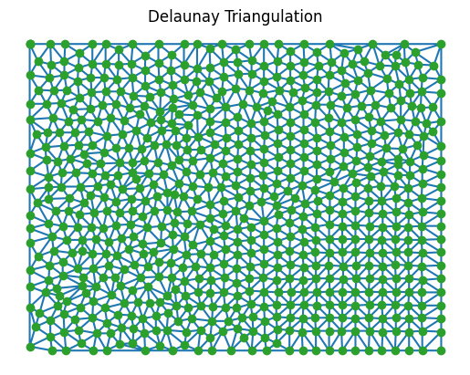
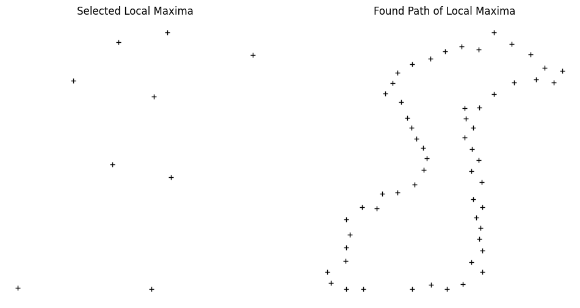
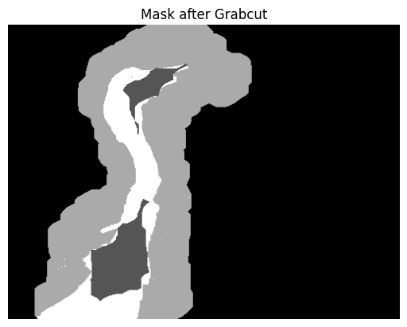
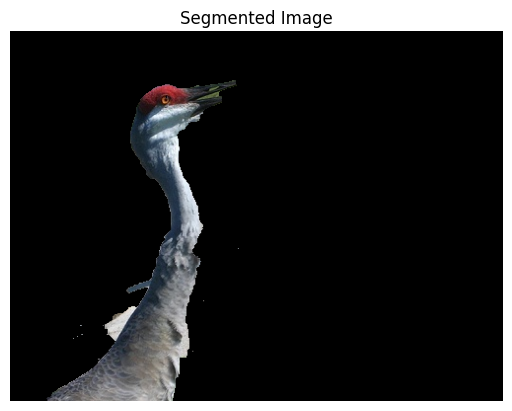

# Assignment 3

Viktor Modroczký\
Computer Vision @ FIIT STU

## Task 1 - GrabCut

Selected image: dog on a chair\
Object of interest: the whole chair

### Steps

1. Draw a mask in Photopea.\
\
The red area marks possible foreground, the whie area marks sure foreground, and the black area marks sure background.

2. Load mask with OpenCV and convert it to a mask with values `cv2.GC_BGD` (black), `cv2.GC_FGD` (gray), and `cv2.GC_PR_FGD` (white) for sure background, sure foreground, and possible foreground, respectively.\

3. Use the mask to initialize the GrabCut algorithm with 5 iterations. The result is shown below.\

4. Mark sure foreground and possible foreground as sure foreground. The result is shown below in comparison with the ground truth.\

5. Apply the mask to the original image. The result is shown below.\

6. Compute DICE coefficient. The resulting similarity is 96.73%.

## Task 2 - Semi-supervised Segmentation

### Proposed algorithm

1. Load image and blur it with a median filter of size 7x7.
2. Apply superpixel segmentation with LSC algorithm with a region size of 16 and 20 iterations.
3. Get inverted superpixel contour mask and apply L2 distance transform. The distance transform is shown below for one of the images.\

4. Compute the local maxima of the distance transform. The result is shown below.\

5. Compute Delaunay triangulation of the local maxima using Scipy and create a graph with nodes as local maxima and edges as Delaunay triangles using NetworkX. The result is shown below.\

6. Show image with superpixel contours overlayed with the original image. Allow the user to select points around an area of interest.
7. Find the closest points to the selected points in array of local maxima.
8. Compute the shortest path between these points using Dijkstra's algorithm. The result is shown below in comparison with the selected local maxima.\

9. Create mask of superpixels that the shortest path traverses. The result is shown below.\

10. Dilate the mask in 3 iterations using an 11x11 structuring element. The result is shown below.\

11. Find contour of the mask and fill it. Compute XOR of the mask with the dilated mask which results in a mask with containing holes of the dilated mask. This way, we can mark the holes as sure foreground. The result is shown below.\

12. Apply grabcut with the created mask and 5 iterations. The resulting mask is shown below.\

13. Mark sure foreground and possible foreground as sure foreground. The result is shown below in comparison with the ground truth for one of the images.\

14. Apply the mask to the original image. The result is shown below for one of the images.\

## Task 3 - Moving Object Segmentation
