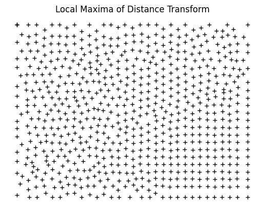
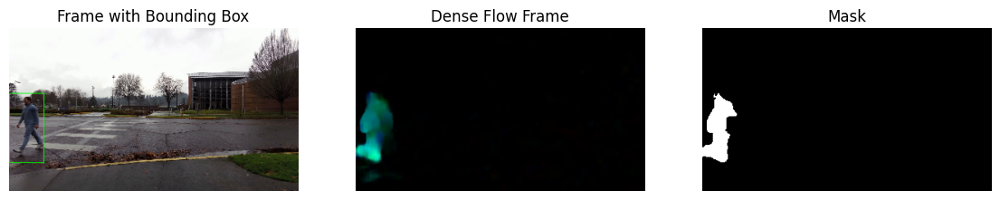
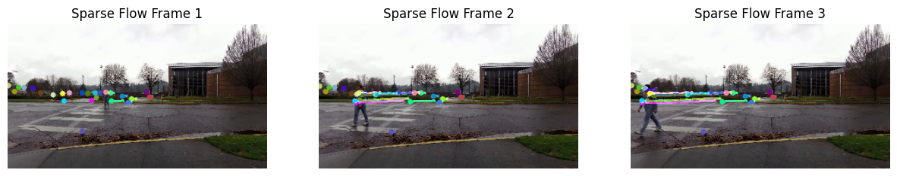

# Assignment 3

Viktor Modroczký\
Computer Vision @ FIIT STU

## Task 1 - GrabCut

The [`task1.ipynb`](task1.ipynb) notebook contains the code and visualizations for this task.

Selected image: dog on a chair\
Object of interest: the whole chair

### Steps

1. Draw a mask in Photopea.\
\
The red area marks possible foreground, the whie area marks sure foreground, and the black area marks sure background.

2. Load mask with OpenCV and convert it to a mask with values `cv2.GC_BGD` (black), `cv2.GC_FGD` (gray), and `cv2.GC_PR_FGD` (white) for sure background, sure foreground, and possible foreground, respectively.\


3. Use the mask to initialize the GrabCut algorithm with 5 iterations. The result is shown below.\


4. Mark sure foreground and possible foreground as sure foreground. The result is shown below in comparison with the ground truth.\


5. Apply the mask to the original image. The result is shown below.\


6. Compute DICE coefficient. The resulting similarity is 96.73%.

## Task 2 - Semi-supervised Segmentation

The [`task2.ipynb`](task2.ipynb) notebook contains the implementation of the semi-supervised segmentation algorithm. The algorithm is also implemented in the [`utils.py`](utils.py) file as a function without visualization called `semisupervised_segmentation`. This version is then used for evaluation.

### Proposed algorithm

1. Load image and blur it to reduce noise while keeping edges sharp using a median filter of size 7x7.
2. Convert the image from BGR to L\*a\*b\* color space for superpixel segmentation.
3. Apply superpixel segmentation with LSC algorithm with a region size of 16 and 20 iterations. The LSC algorithm creates superpixels that copy edges in images well while they are more consistent in shape and size then the other two algorithms. This is an advantage for the proposed algorithm for graph creation explained in later steps. Refer to the [images](images) folder for comparison of [SLIC](images/slic.png), [SEEDS](images/seeds.png), and [LSC](images/lsc.png) results ([images/slic.png](images/slic.png), [images/seeds.png](images/seeds.png), [images/lsc.png](images/lsc.png)).
4. Get inverted superpixel contour mask and apply L2 distance transform. The distance transform is shown below for one of the images.\

5. Compute the local maxima of the distance transform. The result is shown below.\

6. Compute Delaunay triangulation of the local maxima using Scipy and create a graph with nodes as local maxima and edges as Delaunay triangles using NetworkX. The result is shown below.\

7. Show image with superpixel contours overlayed with the original image. Allow the user to select points around an area of interest.
8. Find the closest points to the selected points in array of local maxima.
9. Compute the shortest path between these points using Dijkstra's algorithm. The result is shown below in comparison with the selected local maxima.\

10. Create mask of superpixels (each dilated by a rectangular 11x11 structuring element in 1 iteration to ensure they are mostly connected) that the shortest path traverses. The result is shown below.\

11. Dilate the mask in 4 iterations using an 7x7 elliptic structuring element to smooth the mask and connect parts that might not yet be connected. The result is shown below.\

12. Find contour of the mask and fill it. Compute XOR of the mask with the dilated mask which results in a mask with containing holes of the dilated mask. This way, we can mark the holes as sure foreground. The result is shown below.\

13. Apply grabcut with the created mask and 5 iterations. The resulting mask is shown below.\

14. Mark sure foreground and possible foreground as sure foreground. The result is shown below in comparison with the ground truth for one of the images. The DICE score between the mask after grabcut and ground truth mask is 91.74%.\

15. Apply the mask to the original image. The result is shown below for one of the images.\


### Algorithm Evaluation

The [`segmentation_test.ipynb`](segmentation_test.ipynb) notebook contains the evaluation of the proposed algorithm. The algorithm is evaluated on 3 more images.

#### Image 1

The DICE score between the mask after grabcut and ground truth mask is 88.84%.


#### Image 2

The DICE score between the mask after grabcut and ground truth mask is 93.58%.


#### Image 3

The DICE score between the mask after grabcut and ground truth mask is 96.82%.


## Task 3 - Moving Object Segmentation

The code for the third task is available in the [`task3.ipynb`](task3.ipynb) notebook along with visualizations.

### Segmentation using MOG

To segment the walking person, we used a MOG2 subtractor algorithm with default OpenCV parameters. In the segmentation masks, we ignored shadows (value 127). To improve the masks, we found the largest contour in the mask and filled it ignoring noise from immobile objects and filling small holes in the area where the person is positioned. We also found where to position a bounding box based on the largest contour. Next, we apllied the mask to the original frames.

The results are shown below for 3 frames from the video.


### Segmentation using Running Average Background Image

The background model was created using a running average with the `cv2.accumulateWeighted` function with alpha 0.02. The background model was then used to segment the walking person using an absolute difference between the background model and the current frame and a threshold of 20. The resulting mask was then processed using morphological closing to fill holes and close gaps near each other. The mask was then processed in the same way as the MOG masks - finding the largest contour, filling it, and finding the bounding box around it to show in the current frame. Next, we segmented the person in the original frames using the mask.

The results are shown below for 3 frames from the video.


### Dense Optical Flow

The dense optical flow was computed using the Farneback method with OpenCV (`cv2.calcOpticalFlowFarneback`) with the following parameters, which are recommended in the OpenCV documentation (except for the `winsize` parameter, which was set to 10, and `iterations`, which was set to 3):

```py
params = {
    "pyr_scale": 0.5,
    "levels": 1,
    "winsize": 10,
    "iterations": 3,
    "poly_n": 7,
    "poly_sigma": 1.5,
    "flags": 0
}
```

where:

- `pyr_scale` is the size multiplier for each layer of the image pyramid,
- `levels` is the number of pyramid layers including the initial image,
- `winsize` is the averaging window size,
- `iterations` is the number of iterations the algorithm does at each pyramid level,
- `poly_n` is the size of the pixel neighborhoods that are approximated with a polynomial for each pixel,
- `poly_sigma` is the standard deviation of the Gaussian that is used to smooth derivatives used as a basis for the polynomial approximations,
- `flags` is a parameter for optional flags.

We also tried to identify the moving object from the dense flow frames based on magnitude thresholding. Magnitude was normalized to the range 0-255 and thresholded at 70. The resulting mask was then processed in the same way as the MOG masks - finding the largest contour, filling it, and finding the bounding box around it to show in the current frame. No segmentation was done due to incorrect identification of the moving object caused by heavy noise in the dense optical flow in earlier frames of the video when the walking person was more distant. This can be seen in the images below - the first two visualizations show incorrect identification of the moving object, while the last four visualizations show correct identification of the moving object in the dense optical flow frames.




### Sparse Optical Flow

To only find points of interest to track in the sparse optical flow, the MOG masks are combined using a bitwise OR operation. The resulting mask is shown below before and after morphological opening with a 15x15 elliptic structuring element to remove noise at the right side of the mask. We used this mask (the `masks_in_one_improved` variable) in the `cv2.goodFeaturesToTrack` function to find points of interest to track only in the area where the person walks throughout the video. We set the parameters to the following values:

```py
feature_params = {
    "mask": masks_in_one_improved,
    "maxCorners": 25,
    "qualityLevel": 0.15,
    "minDistance": 7,
    "blockSize": 7
}
```

where:

- `mask` is the mask with the area of interest,
- `maxCorners` is the maximum number of corners (tracked points) to find,
- `qualityLevel` is a value that is used to multiply the best corner's quality measure. The corners with the quality measure less than the product are rejected,
- `minDistance` is the minimum possible Euclidean distance between the returned corners,
- `blockSize` is the size of the block where derivatives are computed.

The parameters for `cv2.goodFeaturesToTrack` were chosen as a result of trial and error to find points that are going to be well tracked throughout the video.

The sparse optical flow was computed using the Lucas-Kanade method with OpenCV (`cv2.calcOpticalFlowPyrLK`) with default parameters left unchanged.

The mask used is shown below.


The images below show 3 frames from the video with sparse optical flow overlayed.



## References

[OpenCV Documentation](https://docs.opencv.org/4.9.0/)\
[Two-Frame Motion Estimation Based on Polynomial Expansion, Gunnar Farnebäck, 2003](https://www.diva-portal.org/smash/get/diva2:273847/FULLTEXT01.pdf)
